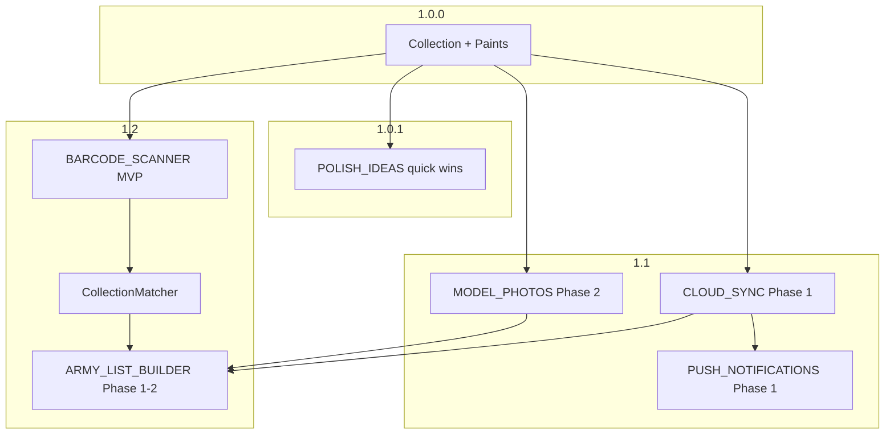

# Product roadmap — MiniMuster iOS

Consolidated release sequencing for post–1.0 work. Each feature has a dedicated spec; this doc is the **order and dependencies** only.

**Current ship target:** [1.0.0](RELEASE_1.0.0.md) — collection, paints, widget, local-first.  
**Strategic north star:** *Muster for the table. Collection for the bench. Paints for the rack.*

---

## Release map

```text
1.0.0  ████████████████████  Ship — collection tracker (now)
1.0.1  ████░░░░░░░░░░░░░░░░  Polish — no new models
1.1    ████████░░░░░░░░░░░░  Photos Phase 2 + iCloud Phase 1 + notifications Phase 1
1.2    ████████████░░░░░░░░  Muster tab MVP + barcode scan + validation lite
1.3+   ░░░░░░░░░░██████████  Muster breadth, BS import, web roster parity (TBD)
```

| Version | Theme | Key deliverables | Specs |
|---------|-------|------------------|-------|
| **1.0.0** | Ship | Collection, paints, widget, backup, onboarding | [RELEASE_1.0.0.md](RELEASE_1.0.0.md) |
| **1.0.1** | Trust & feel | Last-backup polish, advance on detail, filter chips, export success | [POLISH_IDEAS.md](POLISH_IDEAS.md) § 1.0.1 stack |
| **1.1** | Progress & safety | Photo timeline + prompt; iCloud sync core; milestone notifications; backup row | [MODEL_PHOTOS.md](MODEL_PHOTOS.md) · [CLOUD_SYNC.md](CLOUD_SYNC.md) · [PUSH_NOTIFICATIONS.md](PUSH_NOTIFICATIONS.md) |
| **1.2** | **Muster** | Third tab, 40k roster builder, collection match, combat patrol scan | [ARMY_LIST_BUILDER.md](ARMY_LIST_BUILDER.md) · [BARCODE_SCANNER.md](BARCODE_SCANNER.md) |
| **1.3+** | Depth | AoS catalog, wargear, BS import, play-adjacent features | Specs above § Phase 3–4 |

---

## Tab evolution

| Version | Tab bar |
|---------|---------|
| 1.0.0 | **Collection** · **Paints** |
| 1.2+ | **Collection** · **Muster** · **Paints** |

Muster is intentionally **after** photos and cloud sync — list building is more valuable when collection data (and photos) sync across devices and rosters can show paint state.

---

## Dependency graph



**Hard dependencies**

- `CollectionMatcher` (Muster) needs stable `Unit` names + optional `SourceMatch` — exists today.
- Photo cover thumbnails on Muster rows — needs [MODEL_PHOTOS.md](MODEL_PHOTOS.md) Phase 1 (underway).
- Roster sync — needs [CLOUD_SYNC.md](CLOUD_SYNC.md) before marketing multi-device Muster.
- Barcode → roster — needs product catalog + Muster Phase 1.

**Soft dependencies**

- Notifications for “army 100%” — works without Muster; Muster adds “list fieldable at 100%” later.

---

## 1.0.1 — polish bundle (suggested)

Pick from [POLISH_IDEAS.md](POLISH_IDEAS.md); no schema changes:

1. Unit detail **Advance** button + swipe visual confirm  
2. **Add another** on add-unit sheet  
3. Last backup relative date + stale styling  
4. Active filter chip bar  
5. **Show welcome tour again** in Settings  
6. Photo: set as cover + full-screen gallery (if photos merged before 1.0.1 tag)

---

## 1.1 — progress & safety bundle

### Photos ([MODEL_PHOTOS.md](MODEL_PHOTOS.md))

- Phase 2: timeline, prompt on advance, before/after  
- Phase 4 (partial): backup v4 zip with photos  

### Cloud ([CLOUD_SYNC.md](CLOUD_SYNC.md))

- Phase 0–1: `updatedAt`, CloudKit container, Settings iCloud row, privacy update  

### Notifications ([PUSH_NOTIFICATIONS.md](PUSH_NOTIFICATIONS.md))

- Phase 1–2: milestones, backup (suppressed when iCloud healthy), weekly digest opt-in  

### App Store

- Update privacy copy for iCloud  
- Screenshots: unit photos + timeline if ready  

---

## 1.2 — Muster bundle

### Muster ([ARMY_LIST_BUILDER.md](ARMY_LIST_BUILDER.md))

**Phase 1 — ship the tab**

- `MusterTab`, `Roster` / `RosterEntry` models  
- Bundled 40k catalog: Grey Knights, Space Marines, Necrons (+2 factions TBD)  
- Points bar, unit browser, text export  
- `minimuster://muster/{id}` deep links  

**Phase 2 — ship the wedge**

- `CollectionMatcher` + fieldable %  
- Link roster ↔ collection army  
- **Add missing to collection**  
- Onboarding page 5: *Muster for the table*  
- App Store screenshot `07-muster-roster`  

### Barcode ([BARCODE_SCANNER.md](BARCODE_SCANNER.md))

- MVP scan → collection; optional “create muster from box”  

### Marketing ([APP_STORE.md](APP_STORE.md) § 1.2 draft)

- Subtitle candidate: *Track, paint & muster armies*  
- Lead screenshot: Muster tab with fieldable %  

---

## Explicitly not scheduled

| Item | Notes |
|------|-------|
| Tournament / ELO | NR territory; not MiniMuster |
| Full BattleScribe engine | Phase 4 import only |
| Web app Muster tab | iOS-first; JSON backup v5 for portability |
| Analytics / accounts | Local-first + iCloud only |

---

## Open program questions

1. **Versioning:** Single 1.2 with Muster + barcode, or Muster alone as 1.2 and scan as 1.3?  
2. **Catalog legal review** before App Store mention of points?  
3. **Rename app** to emphasize Muster on store listing, or keep MiniMuster with Muster tab inside?  

---

## Changelog

| Date | Notes |
|------|-------|
| 2026-06-15 | Initial roadmap — consolidates future specs |
